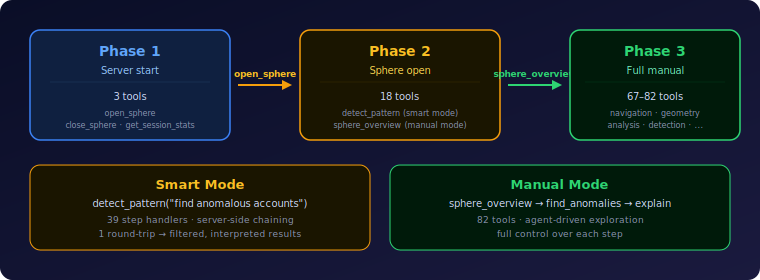

# hypertopos-mcp

> **MCP server for hypertopos geometric data sphere.**

[](https://www.python.org/downloads/)
[](LICENSE)
[](https://modelcontextprotocol.io)
[](pyproject.toml)

**hypertopos-mcp** gives AI agents a safe, stateful way to explore Geometric Data Spheres without writing SQL or touching the storage layer. It wraps the [hypertopos](https://github.com/hypertopos/hypertopos-py) core library into 66 MCP tools with automatic context management, 3-phase tool visibility, smart detection recipes, and graph+geometry fusion — runtime graph traversal scored by population-relative geometry, anomaly contagion tracing, influence propagation, and cluster bridge discovery.

## Quick Start

```bash
pip install hypertopos-mcp
```

Run the server:

```bash
hypertopos-mcp
```

Or as a module:

```bash
python -m hypertopos_mcp.main
```

## Configuration

Set `HYPERTOPOS_SPHERE_PATH` so the first tool call can open the sphere automatically.

```json
{
  "mcpServers": {
    "hypertopos": {
      "command": "hypertopos-mcp",
      "env": {
        "PYTHONPATH": "/path/to/hypertopos-mcp/src:/path/to/hypertopos",
        "HYPERTOPOS_SPHERE_PATH": "/path/to/gds/sphere"
      }
    }
  }
}
```

Use relative sphere paths when calling `open_sphere`. Absolute Windows paths are not supported.

## Smart Detection

The primary entry point after opening a sphere is `detect_pattern(query)` — a meta-tool that plans and executes detection workflows server-side. Describe what you want to find in natural language; the server selects from 39 step handlers, chains them with dependency resolution, and returns filtered, interpreted results in a single round-trip.

For manual exploration, call `sphere_overview()` first to unlock granular tools.

## 3-Phase Tool Visibility



Tool registration is dynamic to minimize token consumption:

| Phase | Trigger | Tools visible |
|-------|---------|---------------|
| **Phase 1** | Server start | 3 tools (`open_sphere`, `close_sphere`, `get_session_stats`) |
| **Phase 2** | `open_sphere` | 16 tools (Phase 1 + gateway + 11 edge table tools) |
| **Phase 3** | `sphere_overview` | 40-66 tools (full manual toolset, capability-dependent) |

## Recommended First Calls

```python
open_sphere("benchmark/berka/sphere/gds_berka_banking")
detect_pattern("find anomalous accounts and explain top findings")
# — or for manual exploration —
sphere_overview()
```

## Using The MCP

### Claude Code

Run `hypertopos-mcp` in the same environment as `hypertopos`, then point your agent session at the workspace that contains the sphere data.

### Claude.ai

1. Install the package in the environment that powers the agent.
2. Configure the MCP server command.
3. Point `HYPERTOPOS_SPHERE_PATH` at a local sphere directory.

### Cursor

Use the package as a local MCP target and keep the sphere path available in the workspace environment. The quickest loop is `open_sphere()` followed by `get_sphere_info()`.

### Codex and other CLI agents

Launch `hypertopos-mcp` alongside the agent process and make sure the same Python environment can import `hypertopos_mcp`. The server works best when the sphere path is set before the first tool call.

### Other platforms

If the platform supports MCP, wire it to `hypertopos-mcp` and keep a local sphere path available. If it only supports Markdown instructions, pair it with the README plus the relevant `benchmark/` notes for the sphere you are using.

## Tool Groups (66 tools)

| Group | Tools | What it covers |
|-------|:-----:|----------------|
| Session & Discovery | 10 | Open/close sphere, schema, search (exact, FTS, hybrid), recalibrate |
| Health & Observability | 6 | Population summary, alerts, data quality, geometry stats, π11/π12 |
| Navigation | 6 | goto, walk, jump, dive, emerge, position |
| Geometry | 3 | Polygon, solid, event polygons |
| Anomaly Detection | 5 | Find anomalies (π5), summary, batch check, explain |
| Similarity & Comparison | 3 | Similar entities, pairwise compare, common relations |
| Aggregation | 1 | Count, sum, avg, min, max, median, percentiles, pivots, filters |
| Population Analysis | 4 | Contrast populations, centroids, clusters (π8), boundary (π6) |
| Hub & Network | 14 | Hubs (π7), neighborhood, counterparties, chains, flow, contagion, velocity, coverage, influence, bridges, anomalous edges |
| Temporal | 8 | Solid (dive, get), hub history, drift (π9), trajectory similarity (π10), time windows, regime changes |
| Risk Profiling | 4 | Cross-pattern profile, composite risk, passive scan |
| Detection Recipes | 2 | `detect_pattern` meta-tool + `sphere_overview` |

Full parameter reference: [docs/tools.md](docs/tools.md)

## Project Layout

```text
src/hypertopos_mcp/
|-- __init__.py
|-- main.py          # entry point
|-- server.py        # FastMCP instance and state management
|-- serializers.py   # model to JSON serialization
|-- enrichment.py    # response enrichment helpers
`-- tools/
    |-- __init__.py
    |-- _guards.py        # response-size guards shared across tools
    |-- session.py        # sphere, entity discovery, search, calibration
    |-- navigation.py     # navigation primitives (pi1-pi6), anomaly scan
    |-- geometry.py       # polygon, solid, event polygons
    |-- analysis.py       # similarity, risk, counterparties, passive scan
    |-- aggregation.py    # fact aggregation with filters and sampling
    |-- observability.py  # health checks, alerts, calibration
    |-- detection.py      # single-call anomaly category recipes
    `-- smart.py          # detect_pattern meta-tool and step handlers
```

## Documentation

| | |
|---|---|
| **[MCP Specification](docs/mcp-spec.md)** | Full server spec: 3-phase loading, 39 step handlers, sampling, resources, prompts |
| **[Tool Reference](docs/tools.md)** | All MCP tool parameters, return shapes, filters |
| **[Core Concepts](https://github.com/hypertopos/hypertopos-py/blob/main/docs/concepts.md)** | GDS mental model, objects, mathematical foundation |
| **[API Reference](https://github.com/hypertopos/hypertopos-py/blob/main/docs/api-reference.md)** | Python API — classes, methods, navigation primitives |

## Notes

- `open_sphere` returns status information only; call `get_sphere_info` right after to learn the full schema.
- Every tool response includes `elapsed_ms` for quick performance checks.

## License

[Apache License 2.0](LICENSE)
